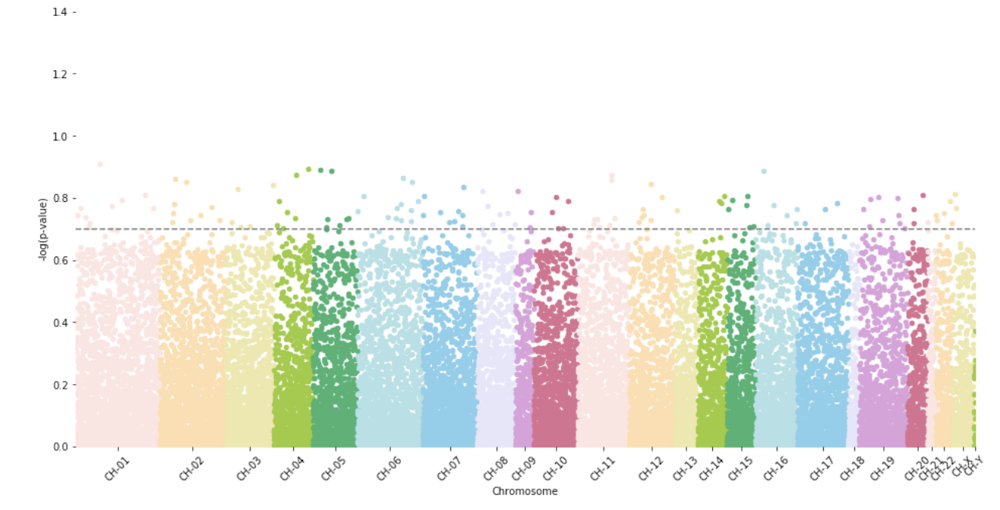

`methylize` is a python package for analyzing output from Illumina methylation arrays.
View on [ReadTheDocs.](https://life-epigenetics-methylize.readthedocs-hosted.com/en/latest/)

[](https://life-epigenetics-methylize.readthedocs-hosted.com/en/latest/) [](https://python.org/pypi/pipenv)  [](https://circleci.com/gh/LifeEGX/methylize)  [](https://www.codacy.com?utm_source=github.com&amp;utm_medium=referral&amp;utm_content=LifeEGX/methylize&amp;utm_campaign=Badge_Grade)
[](https://coveralls.io/github/LifeEGX/methylize)

## Methylize Package

The `methylize` package contains both high-level APIs for processing data from local files and low-level functionality allowing you to analyze your data AFTER running `methylprep` and `methylcheck`. For greatest usability, import `methylize` into a Jupyer Notebook along with your processed sample data (a DataFrame of beta values or m-values and a separate DataFrame containing meta data about the samples).

`Methylize` allows you to run linear or logistic regression on all probes and identify points of interest in the methylome where DNA is differentially modified. Then you can use these regression results to create *volcano plots* and *manhattan plots*.

 

## Installation

```python
pip install methylize
```

## differentially methylated position/probe (DMP) detection

The `diff_meth_pos()` function searches for individual differentially methylated positions/probes
(DMPs) by regressing the methylation M-value for each sample at a given
genomic location against the phenotype data for those samples.

Phenotypes can be provided as
  - a list of string-based,
  - integer binary data,
  - numeric continuous data
  - (TODO: use the methylprep generated meta-data dataframe as input)

The function will coerge string labels for phenotype into 0s and 1s when running logistic regression.
Only 2 phenotypes are allowed with logistic regression. Linear regression can take more than two phenotypes.

### Inputs and Parameters
-------------------------

    meth_data:
        A pandas dataframe of methylation M-values for
        where each column corresponds to a CpG site probe and each
        row corresponds to a sample.
    pheno_data:
        A list or one dimensional numpy array of phenotypes
        for each sample row in meth_data.
        - Binary phenotypes can be presented as a list/array
        of zeroes and ones or as a list/array of strings made up
        of two unique words (i.e. "control" and "cancer"). The first
        string in phenoData will be converted to zeroes, and the
        second string encountered will be convered to ones for the
        logistic regression analysis.
        - Use numbers for phenotypes if running linear regression.
    regression_method: (logistic | linear)
        - Either the string "logistic" or the string "linear"
        depending on the phenotype data available.
        - Default: "linear"
        - Phenotypes with only two options (e.g. "control" and "cancer") can be analyzed with a logistic regression
        - Continuous numeric phenotypes (e.g. age) are required to run a linear regression analysis.
    q_cutoff:
        - Select a cutoff value to return only those DMPs that meet a
        particular significance threshold. Reported q-values are
        p-values corrected according to the model's false discovery
        rate (FDR).
        - Default: 1 -- returns all DMPs regardless of significance.
    export:
        - default: False
        - if True or 'csv', saves a csv file with data
        - if 'pkl', saves a pickle file of the results as a dataframe.
        - USE q_cutoff to limit what gets saved to only significant results.
            by default, q_cutoff == 1 and this means everything is saved/reported/exported.
    filename:
        - specify a filename for the exported file.
        By default, if not specified, filename will be `DMP_<number of probes in file>_<number of samples processed>_<current_date>.<pkl|csv>`
    shrink_var:
        - If True, variance shrinkage will be employed and squeeze
        variance using Bayes posterior means. Variance shrinkage
        is recommended when analyzing small datasets (n < 10).
        (NOT IMPLEMENTED YET)

### Returns
-----------

    A pandas dataframe of regression statistics with a row for each probe analyzed
    and columns listing the individual probe's regression statistics of:
        - regression coefficient
        - lower limit of the coefficient's 95% confidence interval
        - upper limit of the coefficient's 95% confidence interval
        - standard error
        - p-value (phenotype group A vs B - likelihood that the difference is significant for this probe/location)
        - q-value (p-values corrected for multiple testing using the Benjamini-Hochberg FDR method)
        - FDR_QValue: p value, adjusted for multiple comparisons

    The rows are sorted by q-value in ascending order to list the most significant
    probes first. If q_cutoff is specified, only probes with significant q-values
    less than the cutoff will be returned in the dataframe.

If Progress Bar Missing:
    if you don't see a progress bar in your jupyterlab notebook, try this:
    - conda install -c conda-forge nodejs
    - jupyter labextension install @jupyter-widgets/jupyterlab-manager

## About BumpHunter

This includes a Jupyter Notebook running `bumphunter` (from R) with variations in parameters to see how sensitive the DMPs found are to different settings like cutoff percentile values, maximum cluster size, preprocessing method, and using Beta vs M-value as the methylation measure in the model.

This function performs the bumphunting approach described by ``Jaffe et al. International Journal of Epidemiology (2012)``. The main output is a table of candidate regions with permutation or bootstrap-based family-wide error rates (FWER) and p-values assigned.

The general idea is that for each genomic location we have a value for several individuals. We also have covariates for each individual and perform regression. This gives us one estimate of the coefficient of interest (a common example is case versus control). These estimates are then (optionally) smoothed. The smoothing occurs in clusters of locations that are ‘close enough’. This gives us an estimate of a genomic profile that is 0 when uninteresting. We then take values above (in absolute value) cutoff as candidate regions. Permutations can then performed to create null distributions for the candidate regions.

The simplest way to use permutations or bootstraps to create a null distribution is to set B. If the number of samples is large this can be set to a large number, such as 1000. Note that this will be slow and we have therefore provided parallelization capabilities. In cases were the user wants to define the permutations or bootstraps, for example cases in which all possible permutations/boostraps can be enumerated, these can be supplied via the permutations argument.

Uncertainty is assessed via permutations or bootstraps. Each of the B permutations/bootstraps will produce an estimated ‘null profile’ from which we can define ‘null candidate regions’. For each observed candidate region we determine how many null regions are ‘more extreme’ (longer and higher average value). The ‘p.value’ is the percent of candidate regions obtained from the permutations/boostraps that are as extreme as the observed region. These p-values should be interpreted with care as the theoretical proporties are not well understood. The ‘fwer’ is the proportion of permutations/bootstraps that had at least one region as extreme as the observed region. We compute p.values and FWER for the area of the regions (as opposed to length and value as a pair) as well. Note that for cases with more than one covariate the permutation approach is not generally recommended; the nullMethod argument will coerce to ‘bootstrap’ in this scenario. See vignette and original paper for more information.
